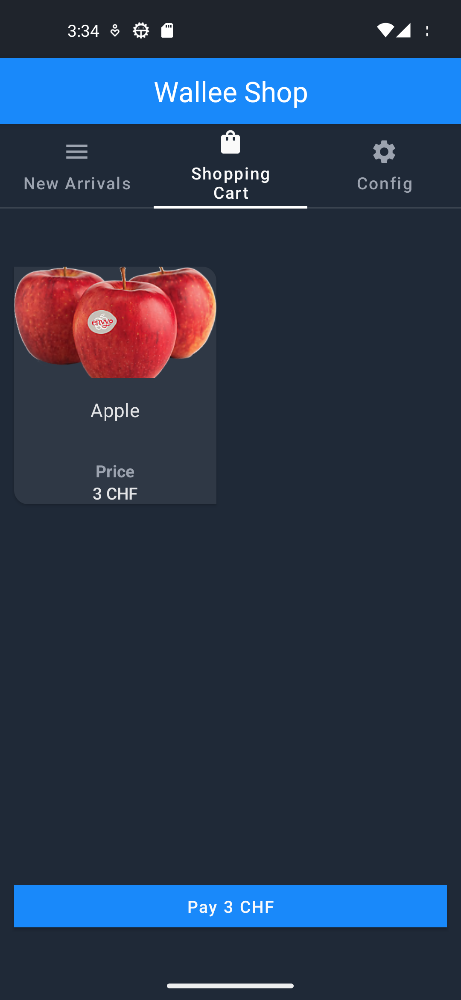
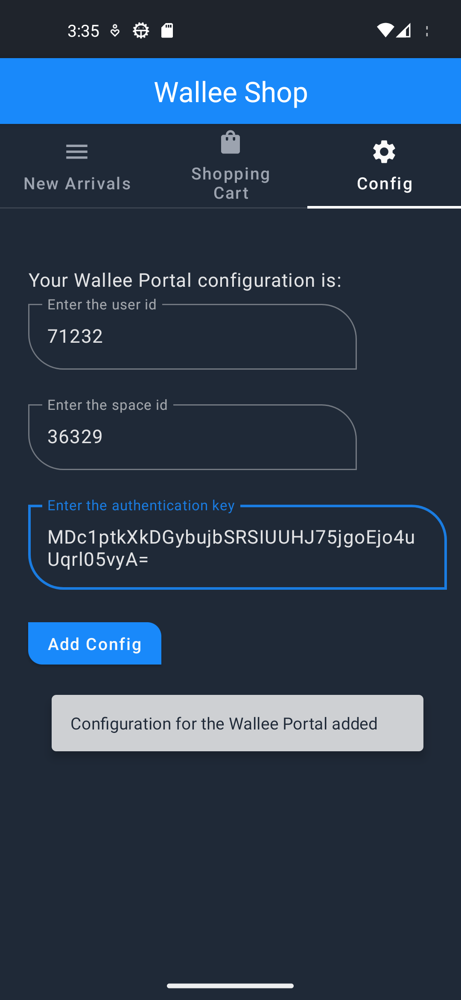
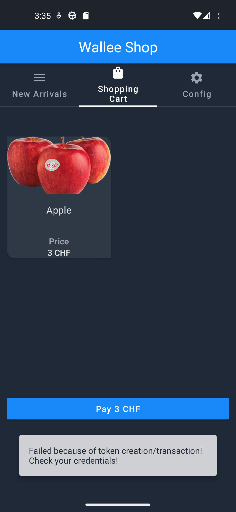

# Wallee Shop - Demo App for wallee Payment SDK

- [Application Architecture](#application-architecture)
- [Wallee Payment SDK integration](#wallee-payment-sdk-integration)
- [Setup Wallee Account](#setup-wallee-account)
  - [Setup Wallee Account](#setup-wallee-account)
- [WalleePaymentSDK init](#walleepaymentsdk-init)
- [Retrofit Client](#retrofit-client)
    - [Create transaction](#create-transaction)
      - [Transaction POJO](#transaction-object)
    - [Create token](#create-token)
    - [Launch the Wallee Payment SDK](#launch-the-wallee-payment-sdk)
    - [Handle the result](#handle-the-result)
- [Theming of the WalleePayment SDK](#theming-of-the-walleepayment-sdk)
- [Licence](#licence)

# Application Architecture
Wallee Shop is an Android application used to demonstrate the Wallee Payment SDK integration.
The application is developed in Kotlin, using Jetpack Compose, Jetpack Navigation and Room. 

The architecture of the application follows the **Android Model-View-ViewModel** architecture with [Clean Architecture](https://blog.cleancoder.com/uncle-bob/2012/08/13/the-clean-architecture.html)
The app separates the responsabilities using the package structure, The code is decoupled and is divided in separate layers:

- **UI Layer**: UI elements that renders the data on screen (Jetpack compose) and State holders (View Models) that hold data, handle logic and expose it to the UI (compose and viewmodels packages)
- **Data layer**: DAOs, Repositories and Data Sources

[Jetpack Compose](https://developer.android.com/jetpack/compose/navigation) is a toolkit for building native UI. 
It has access to the Android platform APIs and build-in support for Material Design, dark theme and animations.
The compose logic can be found in the [compose package](https://github.com/wallee-payment/android-sdk-demo-app/blob/da518223488e36f3e1e84c27f7e2c03cedfc68fd/app/src/main/java/com/wallee/samples/apps/shop/compose).

**Dependency injection (DI)** is a technique widely used in programming and well suited to Android development.
[Hilt](https://developer.android.com/training/dependency-injection/hilt-android) automatically constructs objects by walking the dependency tree, provides compile-time guarantees on dependencies,
and creates dependency containers for Android framework classes.
The [ViewModels](https://github.com/wallee-payment/android-sdk-demo-app/blob/da518223488e36f3e1e84c27f7e2c03cedfc68fd/app/src/main/java/com/wallee/samples/apps/shop/viewmodels) are provided by annotating it with @HiltViewModel and using the @Inject annotation in the ViewModel object's constructor.

The [Room](https://developer.android.com/training/data-storage/room) persistence library provides an abstraction layer over SQLite to allow fluent database access while harnessing the full power of SQLite.
The database configuration and the data access objects (DAO) can be found in the [data package](https://github.com/wallee-payment/android-sdk-demo-app/blob/da518223488e36f3e1e84c27f7e2c03cedfc68fd/app/src/main/java/com/wallee/samples/apps/shop/data). 
Some queries are asynchronous and some are observable queries (for the shopping cart update).

The app configuration is stored using **Jetpack DataStore**.
Jetpack DataStore is a data storage solution that allows you to store key-value pairs or typed objects with protocol buffers. 
DataStore uses Kotlin coroutines and Flow to store data asynchronously, consistently, and transactionally.

[Retrofit](https://square.github.io/retrofit/) is a type-safe http client which is used to retrieve, update and delete the data from web services.

Shop Items            |  Shop Cart
:-------------------------:|:-------------------------:
 |   

# Wallee Payment SDK Integration
Add Wallee Payment SDK to your ```build.gradle.kts```
```
implementation("com.wallee:wallee-payment-sdk:1.1.0")
```

In the current implementation, the dependey is add in the build.gradle.kts file:
```implementation(libs.wallee.payment.sdk)```

and the version can be found in libs.versions.toml (configuration file):
```
walleePaymentSdk = "1.1.0"
wallee-payment-sdk = { module = "com.wallee:wallee-payment-sdk", version.ref = "walleePaymentSdk" }
```

## Setup Wallee Account
In order to be able to create transactions, you need a Wallee Account.
Sign up, set up your space and enable the payment methods you would like to support.

In addition to that, an application user should be created.
The user id and the application key generated from the Wallee Portal are used to authenticate the request.
Check the [Portal documentation](https://app-wallee.com/en-us/doc/api/web-service) or contact customer support for more details.

The user id, space id and application key should be used in the configuration screen. .

# WalleePaymentSDK init
It is recommended to initialize the WalleePaymentSdk in [Application](app/src/main/java/com/wallee/samples/apps/shop/ShopActivity.kt) class.

```
@HiltAndroidApp
class MainApplication : Application(), Configuration.Provider {
    override fun getWorkManagerConfiguration(): Configuration =
        Configuration.Builder()
            .setMinimumLoggingLevel(if (BuildConfig.DEBUG) android.util.Log.DEBUG else android.util.Log.ERROR)
            .build()

    private val _paymentResultState = MutableLiveData<PaymentResult>()
    val paymentResultState: LiveData<PaymentResult> get() = _paymentResultState

    override fun onCreate() {
        super.onCreate()

        WalleePaymentSdk.init(listener = object : OnResultEventListener {
            override fun paymentResult(paymentResult: PaymentResult) {
                _paymentResultState.postValue(paymentResult)
            }
        })
    }
}
```

## Retrofit client
In order to create a transaction, [Retrofit library](https://square.github.io/retrofit/) can be used.

### JWT Token
To authenticate the request, you need to create a JSON Web Token.
This should be included in the **Authorization** header. 
For more details, check the [wallee Portal documentation](https://app-wallee.com/en-us/doc/api/web-service/v2#_authentication)

The **header** of the JWT Token should contain:
```
{
    "alg": "HS256", // Defines the signing algorithm that is used, must be `HS256`
    "type": "JWT", // The type of the token, must be JWT
    "ver": 1 // The version of the JWT authorisation method
}
```

**Payload** ("sub" is the user ID you created in Wallee Portal)
```
{
  "sub": "71232",
  "iat": 1686831204,
  "requestPath": "/api/transaction/create?spaceId=36329",
  "requestMethod": "POST"
}
```
The token should be signed with the application user's authentication key.

The JWT token generated can be verified using [https://jwt.io/](https://jwt.io/)

Example of JWT Token Creation from the app:
```
private fun getJwtToken(accessKey: String, userId: String, requestPath: String): String {
    val claims = mapOf(
        "requestMethod" to "POST",
         "requestPath" to requestPath
    )
    
    try {
        val key: SecretKey = Keys.hmacShaKeyFor(Decoders.BASE64.decode(accessKey))
        val token = Jwts.builder()
                    .setSubject(userId)
                    .setIssuedAt(Date())
                    .signWith(key, SignatureAlgorithm.HS256)
                    .setHeaderParam("ver", "1")
                    .setHeaderParam("typ", "JWT")
                    .addClaims(claims)
                    .compact()
        return "Bearer $token"
    } catch (ex : Exception) {
        Log.d(TAG, "Unable to create the secret key! Please check the application key provided.")
    }
    return ""
}
```

The JWT Token is added in to header's requests as a Bearer token using a network interceptor.
```
val client = OkHttpClient.Builder()
    .addInterceptor(logger)
    .addNetworkInterceptor(
        Interceptor { chain ->
            val original = chain.request()
            val request = original.newBuilder().addHeader("Authorization", getJwtToken(accessKey, userId, requestPath)).build()
            Log.d(TAG, request.toString())
            chain.proceed(request)
        })
    .build()
```

The base URL used by the Retrofit client is
```
private const val BASE_URL = "https://app-wallee.com/api/transaction/"
```
### Converters
Converters can be added to support types. 
Both ScalarsConverterFactory and GsonConverterFactory are used.

```
fun create(accessKey: String, userId: String, requestPath: String): PortalService {
    val gson = GsonBuilder().setLenient().create()
    return Retrofit.Builder()
                .baseUrl(BASE_URL)
                .client(client)
                .addConverterFactory(ScalarsConverterFactory.create())
                .addConverterFactory(GsonConverterFactory.create(gson))
                .build()
                .create(PortalService::class.java)
}
```
## Create Transaction
In the Shopping Cart Screen, the checkout button calls the Portal View Model to create a transaction and a token
associated with the it.

```
portalViewModel.createToken(transaction, configViewModel.settings, launchSdk)
```

A transaction holds information about the customer and the line items and tracks charge attempts and the payment state.

The [portal package](https://github.com/wallee-payment/android-sdk-demo-app/blob/da518223488e36f3e1e84c27f7e2c03cedfc68fd/app/src/main/java/com/wallee/samples/apps/shop/portal) contains the data model for the Transaction.

### Transaction Object
An simple example of the transaction object is:
```
fun createTransaction(sumOf: Int): String {
    val myLineItem = LineItems(
                            amountIncludingTax = sumOf,
                            name = "items-demo-shop",
                            quantity = 1,
                            shippingRequired = true,
                            sku = "items-demo-shop",
                            type = "PRODUCT",
                            uniqueId = "items-demo-shop"
                    )

    val body = Transaction(
        currency = "CHF",
        language = Locale.getDefault().toLanguageTag(),
        lineItems = arrayListOf(myLineItem)
    )

    return Gson().toJson(body)
}
```

The POST call has the transaction body and the space Id from the Wallee Portal.

```
@retrofit2.http.Headers("Content-Type: application/json")
@POST("create")
fun createTransaction(@Query("spaceId") spaceId: String, @Body body: String): Call<Transaction>
```

## Create Token
Once the transaction has been created, your endpoint can fetch an access token by calling the create transaction credentials API endpoint. 
The access token is returned and passed to the Wallee Payment SDK.

```
@POST("createTransactionCredentials")
@retrofit2.http.Headers("Content-Type: application/json")
fun createTransactionToken(
    @Query("spaceId") spaceId: String,
    @Query("id") id: Int
): Call<String>
```

The same mechanism to generate the JWT token is used, but the request path is updated:

```
{
    "sub": "71232",
    "iat": 1686831408,
    "requestPath": "/api/transaction/createTransactionCredentials?spaceId=36329&id=117418492",
    "requestMethod": "POST"
}
```

## Launch the Wallee Payment SDK  
Based on the token obtained at [Create Token step](#create-token), the Wallee Payment SDK is launched 
and the payment method can be chosen.

```
fun launchSdkFromActivity(token: String) {
    WalleePaymentSdk.instance?.launch(
            token,
            this
    ) ?: run {
        Log.e(TAG, "SDK is not initialized. Did you forget to run init on Application?")
      }
}
```
## Handle the result
In order to handle the transaction result, you need to add an **observer** in the class that extends the [**AndroidEntryPoint**](app/src/main/java/com/wallee/samples/apps/shop/ShopActivity.kt) class.

```
@AndroidEntryPoint
class ShopActivity : AppCompatActivity() {

    val resultViewModel: ResultViewModel by viewModels()
    
     override fun onCreate(savedInstanceState: Bundle?) {
        super.onCreate(savedInstanceState)
        initWallee()
        ....
    }

    private fun initWallee() {
        (application as? MainApplication)?.paymentResultState?.observe(this) { paymentResult ->
            val paymentResultAsString = paymentResult.code.toString()

            Log.d(
                TAG,
                "Payment Result Received: $paymentResultAsString"
            )

            resultViewModel.setPaymentResult(paymentResultAsString)
        }
    }
}
```

The response object contains the **result code** and **message**.

The result code describes the result status:

| Code         | Description |
|--------------|-------------|
| COMPLETED | The payment was successful. |
| FAILED | The payment failed. Check the message for more information. |
| CANCELED | The customer canceled the payment. |

The message providing a localized error message that can be shown to the customer.

The result of the transaction is sent to the ResultViewModel. The role of the view model is to expose this to the screen.

| Successful Transaction               | Transaction/Token Creation failed  |
|--------------------------------------|------------------------------------|
|  |     |


# Theming of the WalleePayment SDK

The appearance of the Wallee Payment Sdk dialog can be customized to match the look and feel of your app. 
This can be done for both the light and dark theme individually.

Colors can be modified by passing a JSON object to the WalleePaymentSdk instance.
You can either completely override the theme or only change certain colors.

Modify the payment dialog's light theme: 
```
WalleePaymentSdk.instance?.setLightTheme(JSONObject)
```

Modify the payment dialog's dark theme.
```
WalleePaymentSdk.instance.setDarkTheme(JSONObject) 
```

Enforce a specific theme (dark, light or your own):
```
WalleePaymentSdk.instance.setCustomTheme(JSONObject, ThemeEnum.DARK)
WalleePaymentSdk.instance.setCustomTheme(JSONObject, ThemeEnum.LIGHT)
```

Example of ```setCustomTheme```
```
fun getCustomTheme(): JSONObject {
  val customTheme = JSONObject()
  customTheme.put("colorBackground", "#0800FC")
  customTheme.put("colorText", "#EA00B6")
  customTheme.put("colorHeadingText", "#FF0071")
  customTheme.put("colorError", "#FF693E")
  return customTheme
  }
```

# Licence
Please see the [license file](LICENSE) for more information.